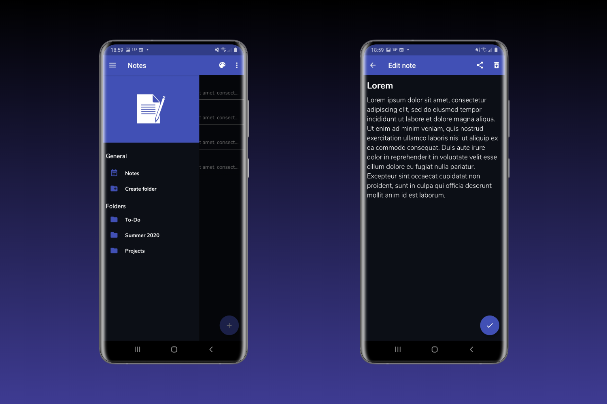

# Notes App Android
 

## Introduction
This is a demo application built with the goal to learn about the MVVM Architectural Pattern and to create a fun application.

See below for more information about what components were used.

## Technologies & Architecture 

#### Technologies
Android, Kotlin

#### Architecture
Model-View-ViewModel (MVVM)

#### Architecture Components
[ViewModel](https://developer.android.com/topic/libraries/architecture/viewmodel), [LiveData](https://developer.android.com/topic/libraries/architecture/livedata), [Room](https://developer.android.com/topic/libraries/architecture/room), [DataBinding](https://developer.android.com/topic/libraries/data-binding), 
[Navigation](https://developer.android.com/guide/navigation/)

## Features
- Notes: Add, edit, remove, undo delete all
- Folders: Add, edit, remove
- Share notes: To and from other apps
- Themes: Change between 3 different themes

## Screenshots

### Main | Notes | Edit

  
  
  

### Themes

  

## Setup
#### Requirements
* Basic knowledge about Android Studio

#### Project
1. Download and open the project in Android Studio
2. Connect your Android phone or use the emulator to start the application

